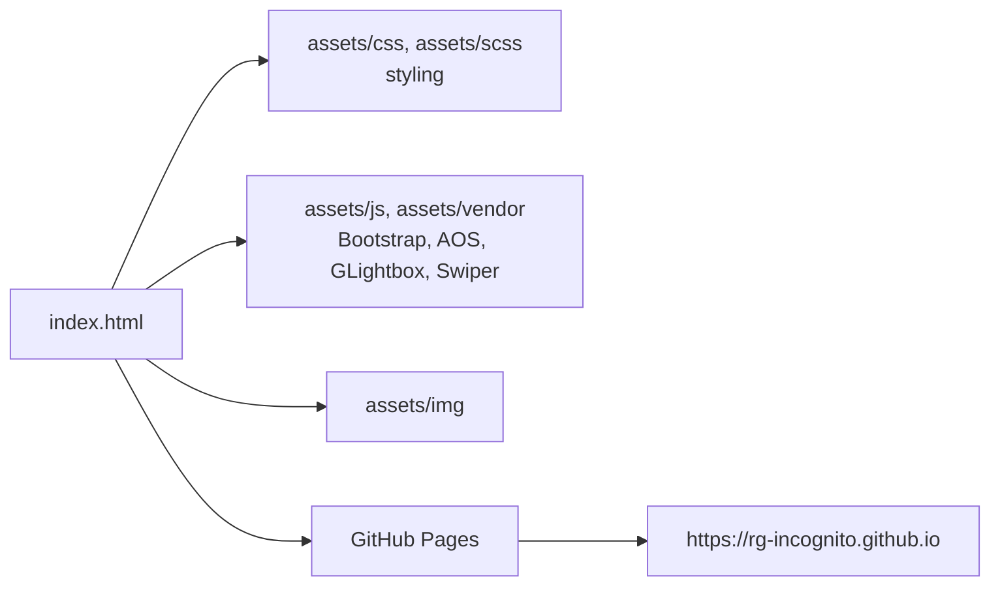

# rg-incognito.github.io

Static personal portfolio site, published via GitHub Pages from this repo's name matching the GitHub Pages convention (`<username>.github.io`). Built on the iPortfolio Bootstrap template.

## How it works

This is a plain static site — `index.html` plus `assets/css`, `assets/js`, `assets/scss`, `assets/img`, and `assets/vendor` (Bootstrap, AOS scroll animations, GLightbox, Swiper, etc.). There's no build step or backend: GitHub Pages serves `index.html` directly at `https://rg-incognito.github.io`.

## Architecture

| Path | Role |
|---|---|
| `index.html` | The entire site — single-page portfolio layout |
| `assets/css`, `assets/scss` | Custom and template styling |
| `assets/js` | Page interactivity |
| `assets/vendor` | Third-party libraries (Bootstrap, Bootstrap Icons, Boxicons, AOS, GLightbox, Swiper) |
| `assets/img` | Site imagery |

## Tech stack

HTML · SCSS/CSS · Bootstrap 5 · vanilla JS · GitHub Pages

## Setup

Just open `index.html` in a browser, or push to `main`/`master` — GitHub Pages serves it automatically.
